# Motion generation and simulation 

## Libraries
Utilisaing [crocoddyl](https://github.com/loco-3d/crocoddyl) open source software for generation and control simulation. 

## Results

Example of Jumping motion generation for FORE:

|  |   |  |   |
:-------------------------:|:-------------------------:|:-------------------------:|:-------------------------:
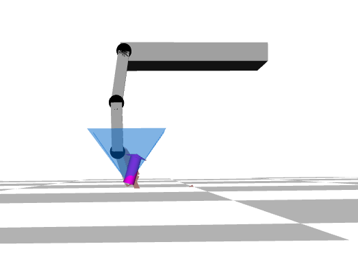  |  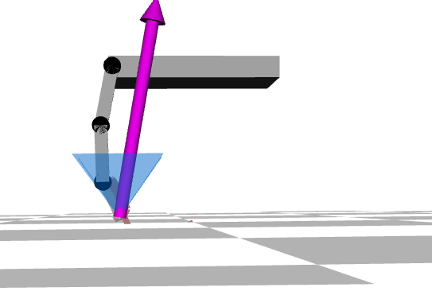 | 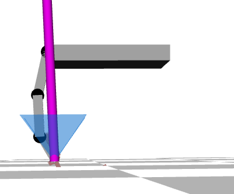 |  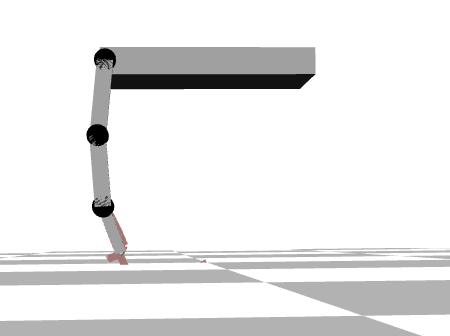
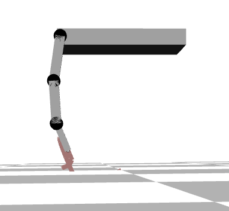  |  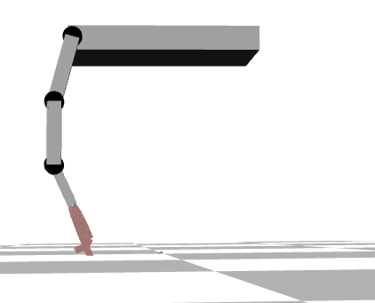 |  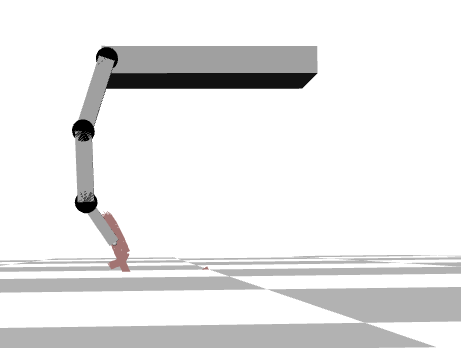 |  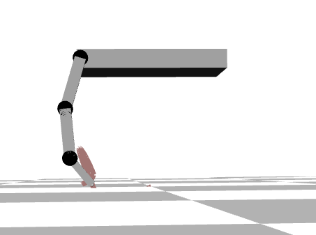


Program can format the results into arrays and write them to a file to be later used for testing the motion. For example: 
```
#define TIME_INDEXES 47
float pos[][TIME_INDEXES] = {
				{0.00, -0.05, -0.10, -0.15, -0.20, -0.23, -0.11, -0.10, -0.12, -0.13, -0.15, -0.17, -0.19, -0.20, -0.22, -0.23, -0.24, -0.26, -0.27, -0.28, -0.29, -0.30, -0.31, -0.31, -0.32, -0.32, -0.33, -0.33, -0.33, -0.33, -0.32, -0.32, -0.32, -0.31, -0.30, -0.30, -0.29, -0.28, -0.26, -0.25, -0.31, -0.31, -0.30, -0.29, -0.29, -0.28, -0.28 },
				{0.00, 0.05, 0.11, 0.16, 0.22, 0.27, 0.17, 0.18, 0.19, 0.20, 0.20, 0.21, 0.22, 0.22, 0.23, 0.24, 0.24, 0.25, 0.26, 0.27, 0.27, 0.28, 0.29, 0.29, 0.30, 0.31, 0.31, 0.32, 0.33, 0.33, 0.34, 0.35, 0.35, 0.36, 0.37, 0.38, 0.38, 0.39, 0.40, 0.40, 0.47, 0.46, 0.45, 0.44, 0.43, 0.43, 0.43 },
				{0.00, 0.10, 0.20, 0.30, 0.40, 0.48, 0.29, 0.30, 0.32, 0.33, 0.34, 0.35, 0.36, 0.37, 0.38, 0.39, 0.40, 0.41, 0.42, 0.43, 0.45, 0.46, 0.47, 0.48, 0.49, 0.50, 0.51, 0.52, 0.53, 0.54, 0.55, 0.56, 0.57, 0.59, 0.60, 0.61, 0.62, 0.63, 0.64, 0.65, 0.76, 0.75, 0.73, 0.72, 0.71, 0.70, 0.70 }
				};
float vel[][TIME_INDEXES] = {
				{0.00, -5.72, -5.20, -5.20, -4.71, -3.17, 12.85, 0.90, -1.93, -1.90, -1.85, -1.80, -1.75, -1.68, -1.61, -1.53, -1.44, -1.35, -1.25, -1.15, -1.04, -0.93, -0.81, -0.69, -0.56, -0.44, -0.31, -0.18, -0.04, 0.09, 0.22, 0.36, 0.49, 0.62, 0.75, 0.88, 1.00, 1.12, 1.24, 1.35, -6.44, 0.27, 1.01, 0.78, 0.54, 0.30, 0.04 },
				{0.00, 5.61, 5.59, 6.12, 6.11, 4.78, -10.32, 1.27, 0.75, 0.74, 0.74, 0.73, 0.73, 0.73, 0.73, 0.72, 0.72, 0.72, 0.72, 0.72, 0.72, 0.72, 0.72, 0.72, 0.72, 0.73, 0.73, 0.73, 0.73, 0.73, 0.73, 0.73, 0.73, 0.73, 0.72, 0.72, 0.72, 0.72, 0.71, 0.71, 6.93, -0.49, -1.49, -1.14, -0.80, -0.47, -0.12 },
				{0.00, 10.78, 10.32, 10.61, 10.27, 8.87, -19.99, 1.16, 1.14, 1.14, 1.14, 1.14, 1.14, 1.14, 1.14, 1.14, 1.14, 1.14, 1.14, 1.14, 1.14, 1.14, 1.14, 1.14, 1.14, 1.14, 1.14, 1.14, 1.14, 1.14, 1.13, 1.13, 1.13, 1.13, 1.13, 1.13, 1.13, 1.13, 1.13, 1.13, 11.14, -1.04, -1.75, -1.35, -0.96, -0.57, -0.13 }
				};
```

One can expect graph outputs: 
|  |   |
:-------------------------:|:-------------------------:
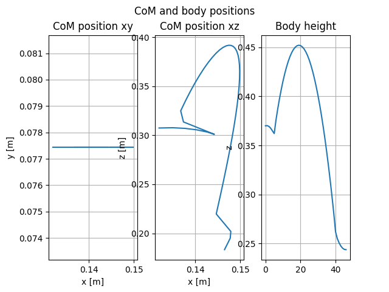   |  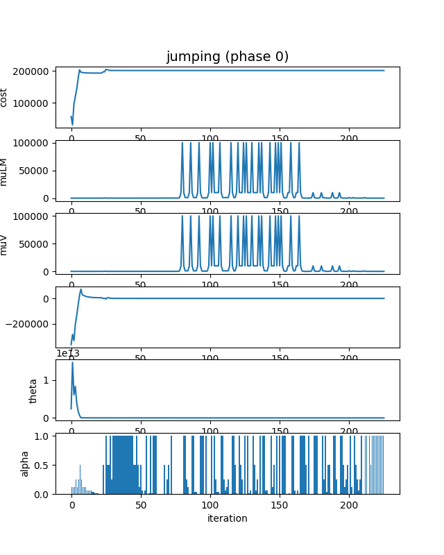   

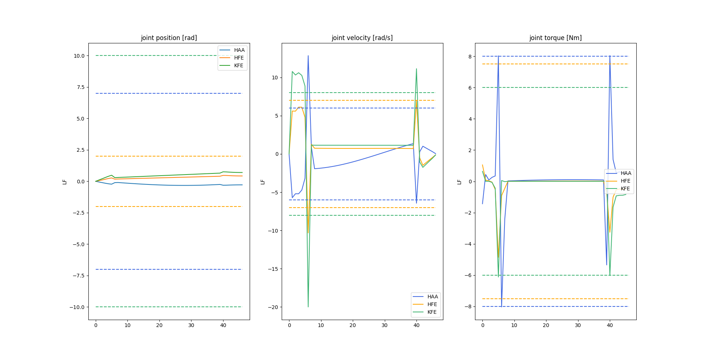     
